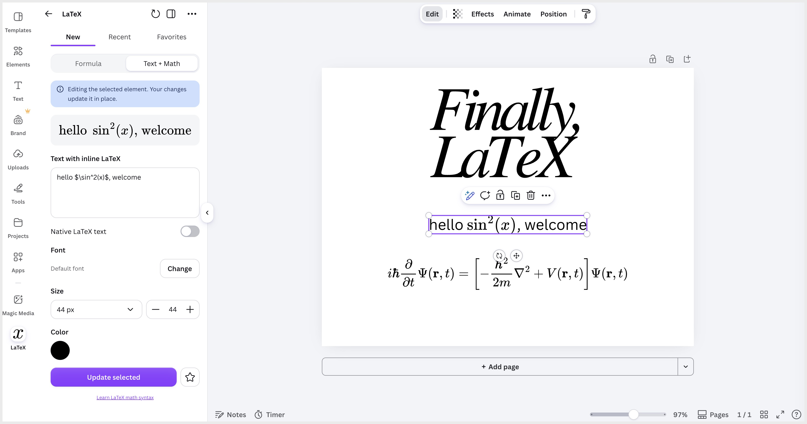

# LaTeX Math for Canva

A Canva app that lets you insert beautiful LaTeX math equations into a design and
**re-edit them at any time** simply by selecting the equation on the page.

Live demo: [canvalatexplugin.vercel.app](https://canvalatexplugin.vercel.app/)

<p align="center">
  
</p>

Built on the [Canva Apps SDK](https://www.canva.dev/docs/apps/) starter kit.

## Features

- **Live preview** — equations render as you type using a fully offline MathJax
  engine (no network calls, no external fonts).
- **Insert as a re-editable element** — formulas are added as Canva
  [app elements](https://www.canva.dev/docs/apps/creating-app-elements/), so the
  original LaTeX is stored on the element itself.
- **Edit on select** — selecting a formula you created reopens it in the editor
  and the **Add to design** button becomes **Update selected formula**.
- **Display or inline** math, adjustable **size**, and a **color** picker that
  uses Canva's brand/document color selector.
- **Recent** tab with thumbnails for quick reuse.

## How it works

| Concern | Approach |
| --- | --- |
| Rendering | [`utils/latex_renderer.ts`](./utils/latex_renderer.ts) converts LaTeX to a self-contained SVG with MathJax (`fontCache: "local"`), pins explicit pixel dimensions, and bakes in the chosen color by replacing `currentColor`. |
| Insertion / editing | [`initAppElement`](https://www.canva.dev/docs/apps/api/latest/design-init-app-element/) stores `{ latex, displayMode, color, fontSize }` (well under the 5 KB limit) and re-runs the renderer in its `render` callback, so equations stay editable. |
| Selection | `appElementClient.registerOnElementChange` keeps the UI in sync with the user's selection and exposes the element's `update` function. |
| UI | The [App UI Kit](https://www.canva.dev/docs/apps/app-ui-kit/) (`Tabs`, `ImageCard`, `FormField`, `SegmentedControl`, `Swatch`, etc.) for native look, theming, accessibility, and localization via `react-intl`. |

The intent code lives in [`src/intents/design_editor/app.tsx`](./src/intents/design_editor/app.tsx).

## Prerequisites

- Node.js `v24+` and npm `v11+`
- A Canva account

## Setup

1. Install dependencies:

   ```bash
   npm install
   ```

2. Install the Canva CLI and log in:

   ```bash
   npm install -g @canva/cli@latest
   canva login
   ```

3. Create an app (or create one in the [Developer Portal](https://www.canva.com/developers/apps)):

   ```bash
   canva apps create "LaTeX Math"
   ```

   Add the resulting `CANVA_APP_ID` to your `.env` file.

4. In the Developer Portal, enable the required **scopes**:
   - `canva:design:content:read`
   - `canva:design:content:write`
   - `canva:asset:private:write`

5. Upload the app icon from [`assets/icon.png`](./assets/icon.png) (source SVG:
   [`assets/icon.svg`](./assets/icon.svg)):
   - Open your app in the [Developer Portal](https://www.canva.com/developers/apps)
   - Go to **App listing details** → **App icon**
   - Upload `assets/icon.png` (512×512, opaque purple background with a math
     italic `x`)
   - The icon is not configured in `canva-app.json`; it is set only in the portal.

6. Start the development server:

   ```bash
   npm start
   ```

   It runs at <http://localhost:8080>.

7. In the Developer Portal, set **App source → Development URL** to
   `http://localhost:8080`, then click **Preview**.

## Canva Dev MCP server

This repo is preconfigured to use the [Canva Dev MCP server](https://www.canva.dev/docs/apps/mcp-server/)
in [`.cursor/mcp.json`](./.cursor/mcp.json). Restart your MCP client (e.g. Cursor)
to pick it up, then ask Canva-specific questions (mentioning "Apps SDK" or
"App UI Kit") to get documentation-grounded help.

## Scripts

- `npm start` — local development server
- `npm run build` — production build into `dist/`
- `npm run lint` / `npm run lint:types` — ESLint and TypeScript checks
- `npm test` — Jest tests

## Notes

- The bundle includes the full MathJax engine (~2.3 MB) so rendering works
  entirely offline. If bundle size becomes a concern, MathJax can be code-split
  and lazy-loaded.
